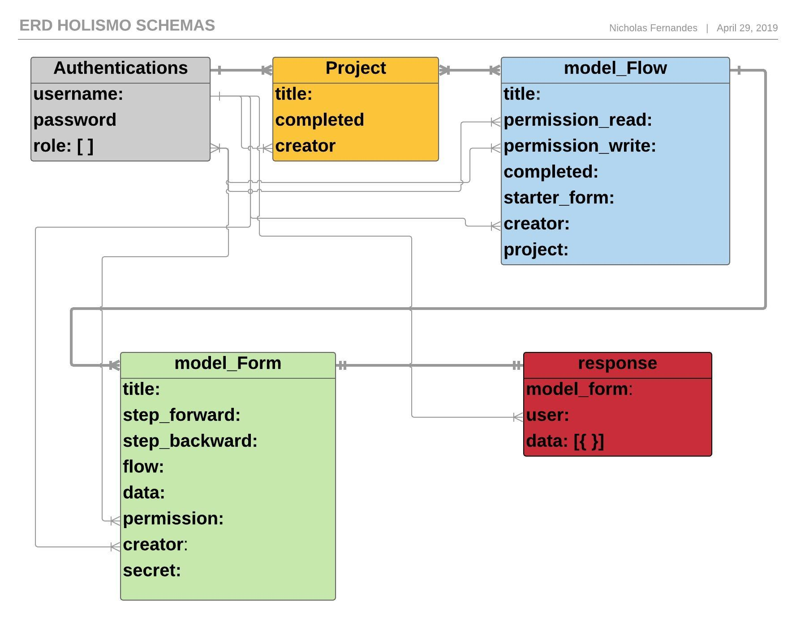

# Configuração e operação da API Holismo

## Informações da API
Stack Utilizada

- Node -v 8.11.2
- Hapi -v 17.8.1
- bcryptjs -v 2.4.3
- Mongoose -v 5.4.4
- MongoDb na AWS -v 4.0.5

## QuickStart
Instalar todas as dependências e então rodar os testes locais é a melhor maneira de começar o projeto.

- Local
```
npm run start
```
- Testes Locais
```
npm run dev
```
- AWS
```
npm run aws
```
- Testes na AWS
```
npm run prod
```
## MongoDB
....

## Utilizando a API
- Local 

Após executar o server a API estará disponível em **localhost:PORT**, sendo PORT determinado no arquivo de configuração em **config/.env.dev**.

Para verificar a utilização da API, o server disponibiliza uma documentação em **localhost:PORT/documentation** através da dependência SWAGGER. Nela é possível verificar todas as rotas e como usa-las.

- AWS

Após executar o server a API estará disponível em **URL_API** como descrito no arquivo **SERVER.md** por segurança.

Para verificar a utilização da API, o server disponibiliza uma documentação em **URL_DOCUMENTAÇÃO** como descrito no arquivo **SERVER.md** por segurança.

## Testes e garantia do funcionamento
Os testes tanto Locais quanto na AWS são responsáveis por popular o MongoDB e garantir o funcionamento de suas funções, para que todos os testes funcionem corretamente é preciso variar os itens criados.

Como garantia de que os testes estão funcionando você pode verificar os resultados pela dependência **Istanbul**.

- Local

Após execução dos testes navegar até **localhost:PORT/coverage**.

- AWS

Após execução dos testes e com o server online navegar até **18.231.115.112:PORT/coverage**.

## Funcionamento Interno da API
